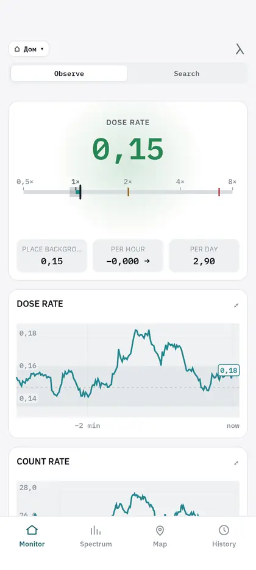

<h1 align="center">Alpha</h1>

<p align="center">
  A modern, convenient Android app for RadiaCode detectors.
</p>

<p align="center">
  <b>English</b> · <a href="README_RU.md">Русский</a>
</p>

<p align="center">
  
  
  
</p>

> [!NOTE]
> This is a third-party app built on a protocol reverse-engineered by the
> community.

<p align="center">
  
</p>

---

## What it is

Alpha holds a Bluetooth link to a RadiaCode detector and records its readings
without breaks: the measurement keeps running while the phone sits in your
pocket, instead of starting over every time you open the screen. Spectra,
tracks and the journal are stored in a database on the phone.

From those records the app builds a profile of the place — what the detector
read here before. Every new value is compared against that profile, and Alpha
reports an excess when the difference passes a statistical test, not when a
number happens to jump.

## Why

Decay is random, so two readings a second apart differ on their own, with no
cause behind it. That is why "0.17 µSv/h" on its own says little: to know
whether it is a lot or an ordinary day, you need what this particular place
gives and how widely its readings scatter anyway.

Alpha keeps that context for you. It shows how far the current value is from
what is usual here, always naming what the comparison is against. When there is
no visible difference it says so — and adds how large a difference it would
have caught in that measuring time.

## What it does

| | |
|---|---|
| **Measuring** | One screen, two questions: *observation* compares against what is usual for the place, *search* against a point you mark yourself. |
| **Search** | Clicks, a tone that rises with the ratio, vibration. They run from the measurement service, so they do not fall silent when the screen goes off. |
| **Journal** | One record per episode — start, end, duration, range — instead of a row per trigger. |
| **Spectrum** | Live accumulation, snapshots, background subtraction, continuum removal, peak search, isotope *candidates*, spectral ranges, spectrogram. |
| **Activity** | With a certified source an efficiency curve is built; after that a matched peak gives activity in becquerels with its uncertainty. |
| **Map** | Track recording as a colour trail, an accumulated grid over many trips, and route comparison. |
| **Dose** | Dose collected over 7, 30 and 90 days, and how much of that time was actually measured. |
| **Export** | HTML, CSV, JSON, GeoJSON, GPX, N42.42 and RadiaCode XML through the system file picker. |

## How a decision is made

- **Place profile.** A place is described by its median and its P10–P90 spread,
  not by an average: one spike does not move it.
- **Difference.** Two counting windows are compared with an exact test for
  counts (Przyborowski–Wilenski, Clopper–Pearson bounds). On small numbers it
  stays correct where the usual normal approximation no longer is.
- **Sensitivity.** When a difference is not accepted, the screen shows the
  limit: "an excess would have been visible from ×1.18". A refusal without its
  limit is not an answer.
- **Peaks.** Area and significance come from side bands, the line centre from
  an asymmetric fit, and only for peaks strong enough to fit.
- **Gaps.** A break in the data is drawn as a break. A day without measurements
  is empty, not zero.

## What the app does not claim

- A peak in a spectrum is a **candidate**, not a proven isotope.
- Comparing two objects is not food testing.
- **Bq/kg does not exist in the app at all.** Becquerels appear only after an
  efficiency curve is built from a certified source, hold only for the same
  geometry, and do not account for self-absorption or cascade coincidences.

## Privacy

- **There is no network code.** Searching the whole app for HTTP clients,
  sockets, WebView and any networking library finds nothing.
- **One thing goes out: map tiles.** `osmdroid` requests OpenStreetMap tiles
  when you open an uncached area. Tile coordinates go out; no measurement and
  no track point goes with them. Everything else works with networking off.
- **No Google Play Services, Firebase, analytics or crash reporting.**
- **Location** is used in two places only: the map shows where you are while it
  is open, and track recording writes points into a route you started yourself.
  Place recognition needs no location at all — it hashes the Wi-Fi gateway
  address on the phone.

## Devices

| Device | Status |
|---|---|
| RadiaCode-110 | **Tested** — the app is developed on it |
| RadiaCode-101 / 102 / 103 / 103G | Should work, **not tested**: same protocol, the model constants are in the code |
| RadiaCode Zero | Counter only — a plastic scintillator gives no peaks, spectral analysis is switched off |

Android 8.0 or newer, Bluetooth LE required.

## Build

You need JDK 17 and the Android SDK with compileSdk 35 (build-tools 35.0.0).
Gradle comes with the repository.

```bash
./gradlew test                 # JVM tests
./gradlew :app:smokeTest       # screen tests
./gradlew :app:lintDebug
./gradlew :app:assembleRelease # unsigned APK
```

The release build is unsigned on purpose — there is no key in the repository.
Sign it with your own:

```bash
BT=$ANDROID_HOME/build-tools/35.0.0
$BT/zipalign -f -p 4 app/build/outputs/apk/release/app-release-unsigned.apk aligned.apk
$BT/apksigner sign --ks <your.keystore> --out alpha.apk aligned.apk
```

## Import and export

**Import:** RadiaCode spectrum XML. Alpha takes the spectrum itself, its
background, the calibration and the timing. Fields it does not know are skipped,
not invented. If the file names a device, that name is dropped: an imported
spectrum is analysed as taken by an unknown instrument, and the screen says so —
guessing the crystal would change peak widths and candidate matching. Files have
a size limit, and DTDs and external entities are disabled in the parser.

**Export:** HTML report, CSV, JSON, GeoJSON, GPX, N42.42 and RadiaCode XML.
Every save goes through the system file picker; the app writes nothing to shared
storage by itself.

## Limitations

- One model has been tested in practice; the rest of the series should work, but
  that is unconfirmed.
- Activity needs a certified source. Without one, becquerels appear nowhere.
- Analysis needs accumulation: peak search refuses on short spectra, and a place
  profile has to mature before it starts comparing.
- Android can stop a long measurement. The app keeps a foreground service and
  offers a battery-optimisation exemption, but aggressive vendor power saving
  can still kill it.
- The map needs network the first time an area is opened.

## Contributing

Issues and pull requests are welcome. Two rules that reviews enforce: wording
never turns a statistic into a verdict about danger, and measurement data never
leaves the device. Both are held by tests.

## License

MIT — see [`LICENSE`](LICENSE). Third-party components and the notices they
require are listed in [`NOTICE`](NOTICE) and inside the app under
Settings → About.

## Sources

- RadiaCode software features — <https://www.radiacode.com/software>
- `cdump/radiacode`, MIT — the community protocol work this Kotlin port follows —
  <https://github.com/cdump/radiacode>
- L. A. Currie, Anal. Chem. 40 (1968) 586 — detection limits
- C. G. Ryan et al., Nucl. Instr. Meth. B34 (1988) 396 — SNIP continuum
- S. Das, arXiv:1603.08591 — ExpGaussExp line shape
- W. Cash, ApJ 228 (1979) 939 — fit statistic for counts
