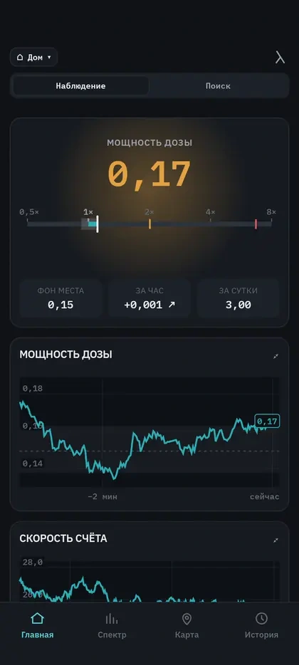

<h1 align="center">Alpha</h1>

<p align="center">
  Современное и удобное Android-приложение для дозиметров RadiaCode.
</p>

<p align="center">
  <a href="README.md">English</a> · <b>Русский</b>
</p>

<p align="center">
  
  
  
</p>

> [!NOTE]
> Это сторонняя разработка на протоколе, разобранном сообществом.

<p align="center">
  
</p>

---

## Что это

Alpha держит связь с дозиметром RadiaCode по Bluetooth и пишет его показания
без перерыва: измерение идёт, пока телефон лежит в кармане, и не начинается
заново при каждом открытии экрана. Спектры, треки и журнал хранятся в базе на
телефоне.

Из накопленных записей приложение строит профиль места — что прибор показывал
здесь раньше. С этим профилем сравнивается каждое новое значение, и о
превышении Alpha сообщает тогда, когда разница проходит статистическую
проверку, а не когда число просто скакнуло.

## Зачем

Распады случайны, поэтому два соседних измерения отличаются сами по себе, без
всякой причины. Из-за этого «0,17 мкЗв/ч» само по себе мало что говорит: чтобы
понять, много это или обычное дело, нужно знать, сколько даёт именно это место
и какой у его показаний естественный разброс.

Этот контекст Alpha ведёт за вас. Она показывает, во сколько раз текущее
значение отличается от привычного здесь, и всегда называет, с чем сравнивает.
Если разницы не видно, приложение так и говорит — и добавляет, какое отличие
оно заметило бы за это время измерения.

## Что умеет

| | |
|---|---|
| **Измерение** | Один экран, два вопроса: в *наблюдении* сравнение идёт с тем, что для места обычно, в *поиске* — с точкой, которую вы отметили сами. |
| **Поиск** | Щелчки, тон, растущий вместе с отношением, вибрация. Работают от службы измерения, поэтому не смолкают при выключенном экране. |
| **Журнал** | Одна запись на эпизод — начало, конец, длительность, размах — вместо строки на каждое срабатывание. |
| **Спектр** | Живое накопление, снимки, вычитание фона, снятие подложки, поиск пиков, изотопы-*кандидаты*, спектральные диапазоны, спектрограмма и сохранение графика картинкой большого размера. |
| **Разложение** | Спектр объясняется целиком формами, которые вы сняли сами — ториевая сетка, калийная соль, собственный фон прибора, — и каждая получает свою долю с погрешностью. Доли, а не беккерели. |
| **Приборы** | Несколько приборов, по одному за раз: у каждого своё имя, а фон места, накопленная доза и фильтр журнала следуют за тем прибором, который их измерил. |
| **Активность** | С поверенным источником строится кривая эффективности; после этого сопоставленный пик даёт активность в беккерелях с погрешностью. |
| **Карта** | Запись трека цветной линией, накопленная сетка по многим поездкам и сравнение маршрутов. |
| **Доза** | Доза, набранная за 7, 30 и 90 дней, и какая часть этого времени действительно измерялась. |
| **Экспорт** | HTML, CSV, JSON, GeoJSON, GPX, N42.42 и RadiaCode XML через системный выбор файла. |

## Как принимается решение

- **Профиль места.** Место описывается медианой и разбросом P10–P90, а не
  средним: один всплеск его не сдвигает.
- **Различие.** Два окна счёта сравниваются точным критерием для счётных данных
  (Пшиборовский—Виленский, границы Клоппера—Пирсона). На малых числах он
  остаётся корректным там, где обычное нормальное приближение — уже нет.
- **Чувствительность.** Если различие не принято, экран показывает предел:
  «превышение было бы видно от ×1,18». Отказ без своего предела — не ответ.
- **Пики.** Площадь и значимость считаются по боковым полосам, центр линии — по
  несимметричной подгонке, и только для пиков, которых для подгонки хватает.
- **Прибор измеряется, а не предполагается.** Ширина линии и уход энергетической
  шкалы от собственной температуры прибора измеряются по его же спектрам:
  паспортное число — одно на модель, а два экземпляра отличаются.
- **Пропуски.** Разрыв в данных рисуется разрывом. День без измерений пустой, а
  не нулевой.

## Чего приложение не утверждает

- Пик в спектре — **кандидат**, а не доказанный изотоп.
- Сравнение двух предметов не является проверкой продуктов.
- **Бк/кг в приложении нет вообще.** Беккерели появляются только после
  построения кривой эффективности по поверенному источнику, действуют лишь для
  той же геометрии и не учитывают самопоглощение и каскадные совпадения.

## Приватность

- **Сетевого кода нет.** Поиск по всему приложению HTTP-клиентов, сокетов,
  WebView и любых сетевых библиотек не находит ничего.
- **Наружу уходит одно: тайлы карты.** `osmdroid` запрашивает тайлы
  OpenStreetMap, когда вы открываете незакэшированный участок. Уходят
  координаты тайла; ни одно измерение и ни одна точка трека с ними не идут.
  Всё остальное работает с выключенной сетью.
- **Нет Google Play Services, Firebase, аналитики и отправки сбоев.**
- **Геолокация** используется только в двух местах: карта показывает, где вы,
  пока она открыта, и запись трека пишет точки в маршрут, который вы запустили
  сами. Распознаванию места геолокация не нужна вовсе — оно хеширует адрес
  Wi-Fi-шлюза на телефоне.

## Приборы

| Прибор | Состояние |
|---|---|
| RadiaCode-110 | **Проверен** — на нём приложение и разрабатывается |
| RadiaCode-101 / 102 / 103 / 103G | Должны работать, **не проверялись**: тот же протокол, константы моделей есть в коде |
| RadiaCode Zero | Только счётчик — пластиковый сцинтиллятор не даёт пиков, спектральный разбор выключен |

Android 8.0 и новее, нужен Bluetooth LE.

## Сборка

Нужны JDK 17 и Android SDK с compileSdk 35 (build-tools 35.0.0). Gradle идёт
вместе с репозиторием.

```bash
./gradlew test                 # JVM-тесты
./gradlew :app:smokeTest       # тесты экранов
./gradlew :app:lintDebug
./gradlew :app:assembleRelease # неподписанный APK
```

Релизная сборка выходит неподписанной специально — ключа в репозитории нет.
Подпишите своим:

```bash
BT=$ANDROID_HOME/build-tools/35.0.0
$BT/zipalign -f -p 4 app/build/outputs/apk/release/app-release-unsigned.apk aligned.apk
$BT/apksigner sign --ks <ваш.keystore> --out alpha.apk aligned.apk
```

## Импорт и экспорт

**Импорт:** спектр RadiaCode в XML. Alpha берёт сам спектр, его фон, калибровку
и время. Неизвестные поля она пропускает, а не додумывает. Если в файле назван
прибор, это имя отбрасывается: импортированный спектр разбирается как снятый
неизвестным прибором, и экран об этом говорит — угадывание кристалла изменило бы
ширины пиков и подбор кандидатов. У файлов есть предел размера, а в разборщике
отключены DTD и внешние сущности.

**Экспорт:** HTML-отчёт, CSV, JSON, GeoJSON, GPX, N42.42 и RadiaCode XML. Любое
сохранение идёт через системный выбор файла; в общее хранилище приложение само
ничего не пишет.

## Ограничения

- Проверена на практике одна модель; остальная серия должна работать, но это не
  подтверждено.
- Для активности нужен поверенный источник. Без него беккерели не появляются
  нигде.
- Разбору нужно накопление: на коротких спектрах поиск пиков отказывается, а
  профилю места надо созреть, прежде чем он начнёт сравнивать.
- Android может остановить долгое измерение. Приложение держит службу переднего
  плана и предлагает исключение из энергосбережения, но агрессивное
  энергосбережение производителя всё равно способно его убить.
- Карте нужна сеть при первом открытии участка.

## Лицензия

MIT — см. [`LICENSE`](LICENSE). Сторонние компоненты и требуемые ими
уведомления перечислены в [`NOTICE`](NOTICE) и внутри приложения в
«Настройки → О приложении».

## Источники

- Возможности ПО RadiaCode — <https://www.radiacode.com/software>
- `cdump/radiacode`, MIT — работа сообщества по протоколу, которой следует этот
  порт на Kotlin — <https://github.com/cdump/radiacode>
- L. A. Currie, Anal. Chem. 40 (1968) 586 — пределы обнаружения
- C. G. Ryan et al., Nucl. Instr. Meth. B34 (1988) 396 — подложка SNIP
- S. Das, arXiv:1603.08591 — форма линии ExpGaussExp
- W. Cash, ApJ 228 (1979) 939 — статистика подгонки для счётных данных